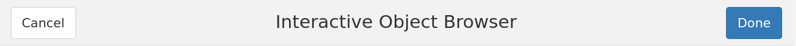

```{r setup, include=FALSE}
library(experiment)
library(knitr)
library(evaluate)
library(stringr)

knitr::opts_chunk$set(collapse = TRUE, comment = "#>", prompt = FALSE)
knitr::opts_chunk$set(echo = TRUE)
knitr::opts_chunk$set(fig.width=8, fig.height=6, fig.align = 'center')
knitr::opts_chunk$set(out.width='65%')
```

```{r output_hook,include=FALSE}
(function() {
  hook_output <- knit_hooks$get('output')
  knit_hooks$set(output = function(x, options) {
    if (!is.null(n <- options$out.lines)) {
      if(length(n) == 1) n <- seq(n)
      x  <- unlist(stringr::str_split(x, '\n'))
      lx <- length(x)
      
      dots <- which(diff(n)>1) + 1
      if (length(dots)) {
        x <- x[sort(c(n, dots))]
        x[dots] <- rep('...', length(dots))
      }
      else {
        x <- x[n]
      }
      
      if (min(n) > 1) x <- c('...', x)
      if (max(n) < lx) x <- c(x, '...')
      
      x <- paste(c(x, ""), collapse = '\n')
      options$out.lines <- NULL
    }
    hook_output(x, options)
  })
})()
```

```{r callback,include=FALSE}
knit_hooks$set(evaluate = function(...) {
  res  <- evaluate::evaluate(...)
  plot <- Filter(evaluate::is.recordedplot, res)
  plot <- if (length(plot)) plot[[1]]

  args  <- list(...)
  state <- experiment:::internal_state
  env   <- args$envir
  expr  <- parse(text = paste(args[[1]], collapse = '\n'))[[1]]
  experiment:::update_current_commit(state, env, plot, expr)

  res
})
```

# Introduction

The goal of this tutorial is to introduce the interactive history browser implemented
in the `experiment` package. It follows one of the examples accessible via
`experiment::simulate_london_meters` and is based on the
[London meter data](https://data.london.gov.uk/dataset/smartmeter-energy-use-data-in-london-households).

History browser keeps track of all expressions evaluated in R session.
It remembers all objects and plots, and allows the user to move back and
forth in that recorded history.

In this short introduction, we will perform a simplified data exploration
exercise, similar to what a "real" data exploration might look like. In
order to keep the big picture clean, we avoid poking around too much.

We start by loading a number of packages we will need for our analysis.
History tracker does not write down commands that do not produce new
objects or plots, so it ignores this next block of code.


```{r message=FALSE}
library(dplyr)
library(lubridate)
library(magrittr)
library(ggplot2)
```


# Turn tracing on

Now it is time to load the `experiment` package and turn on its tracing
capability. `experiment` will register a callback using `addTaskCallback`
and using that callback it will keep record of changes in the global
environment of our R session[^hacks].

[^hacks]: Of course, that's not how things work inside knitr. Thus, this
vignette contains code *as it is supposed to look*, and you should be
able to simply copy & paste it into R session. The actual source code of
the *vignette* will reveal much more than that.


```{r tracking,eval=FALSE}
library(experiment)
tracking_on()
#> Warning: creating a store named "project-store" under
#> "/home/user/my-data-project"
```

Calling `tracking_on()` in a live R session will change the R prompt
to `[tracked] > `. In this vignette, in order to make it easier to
copy the R code, the promp remains hidden.

Another important thing to notice is the warning *"creating a store
named..."* which informs the user that all objects created in the current
session will be stored in a newly created *object store*[^store]. Thus,
it is perfectly possible to peform the exercise described in this
vignette over a period of multiple days, while closing and reopening R
session to pick up the work where it was previously left off.

[^store]:  Object store is a persistent, filesystem-based repository of
R artifacts (data sets, functions, plots, etc.) produced while working
with R.


# Preparing the data set

Here is the first command that produces a (new) data object. It reads,
transforms and filters a CSV file distributed with the `experiment`
package.

```{r message=FALSE}
input <-
  system.file("extdata/block_62.csv", package = "experiment") %>%
  readr::read_csv(na = 'Null') %>%
  rename(meter = LCLid, timestamp = tstp, usage = `energy_kWh`) %>%
  filter(meter %in% c("MAC004929", "MAC000010", "MAC004391"),
         year(timestamp) == 2013)
```


Let's look at the data. It turns out that the observations are recorded
every 30 minutes.

```{r}
head(input)
```


Let's agregate them and continue with hourly readings.

```{r}
input %<>%
  mutate(timestamp = floor_date(timestamp, 'hours')) %>%
  group_by(meter, timestamp) %>%
  summarise(usage = sum(usage))
```


# The first meter

We have three meters in the data set, `r unique(input$meter)`. We will
look at them one by one, starting with this one.

```{r}
input %<>% filter(meter == "MAC004929")
```


Just a glimpse on the full data set, before we look aggregations.

```{r}
with(input, plot(timestamp, usage, type = 'p', pch = '.'))
```


All right! That doesn't reveal much, how about breaking the data set
down by hour and day of week? Any patterns here? We start with aggregating
the `input` set into a temporary variable `x`.

```{r}
x <-
  input %>%
  mutate(hour = hour(timestamp),
         dow  = wday(timestamp, label = TRUE)) %>%
  mutate_at(vars(hour, dow), funs(as.factor)) %>%
  group_by(hour, dow) %>%
  summarise(usage = mean(usage, na.rm = TRUE))
```


And now we can take a look at the by-hour plot:

```{r}
with(x, plot(hour, usage))
```


And the hour-by-day-of-the-week breakdown:

```{r}
ggplot(x) + geom_point(aes(x = hour, y = usage)) + facet_wrap(~dow)
```


So these are mean values. How about the distribution arund the mean?
We can visualize that with a boxplot. Start with overwriting the `x`
variable and then produce a new plot.

```{r group}
x <-
  input %>%
  mutate(hour = hour(timestamp),
         dow  = wday(timestamp)) %>%
  mutate_at(vars(hour, dow), funs(as.factor))
```

```{r boxplot}
ggplot(x) + geom_boxplot(aes(x = hour, y = usage)) + facet_wrap(~dow)
```


OK! Let's look at a linear model for this data.

```{r}
m <- lm(usage ~ hour:dow, x)
```

```{r summary,out.lines=c(1:14,178:186)}
summary(m)
```


At this point we might decide we know enough. (We probably don't yet, but
for the sake of the presentation, we let's assume we actually do. After
all this is an introduction to the history browser, not to time series
analysis.)


# History recorded so far

So what does the history look like so far? We can open an interactive
viewer by calling `experiment:::browserAddin()`. It is a `htmlwidget`
so when you do it in actual R session in RStudio, it will open in an
interactive window, overlying the main RStudio window[^gadget][^addins].
In RStudio you will also have extra buttons and interactions, more about
this in the next section.

[^gadget]: The mechanics of that are not part of this vignette, however,
in case this turns out to be helpful: in RStudio it is a gadget, created
with `shiny::runGadget`, and displayed in a `shiny::dialogViewer`.

[^addins]: Also, in RStudio, you can map this function under a key
shortcut. `experiment` contains all the necessary configuration files.
See [RStudio Addins](https://rstudio.github.io/rstudioaddins/#keyboard-shorcuts)
for more details.


```{r fake_history,eval=FALSE}
experiment::browserAddin()
```
```{r fullhistory,fig.width=7,fig.height=5,out.width='100%',echo=FALSE}
plot(fullhistory())
```

Each node represents either an object introduced at some point in time
to R session, or a plot. Objects have their names displayed inside the
node, plots are shown as thumbnails.

You can hover your mouse cursor over each node in the history and see
the expression that produced the given object along with its general
characteristics, like dimensions of a `data.frame` or the `AIC` value
for a linear model.


# Second meter

Let's go back to the last step before narrowing down to just one meter.
Clicking on the second `input` node in the history window selects that
node (notice the green highlight on the border of the node). In RStudio,
at this point you need to click on the *Done* button, but since this is
a static HTML vignette, that button is not available. The *Done* button
together with the whole window title bar looks as below:

{width=100%}

Thus, highlighting the node and clicking on the *Done* button brings back
the state of R session when that object was created - which we will assume
happens at this point of our vignette. We restore state of the R session
from the time when the second `input` node was created.

```{r restore,include=FALSE}
restore('40692a8b662cc0327e12076193c13a8b730d2fc0')
```


Now we can try a different house.

```{r}
input %<>% filter(meter == "MAC000010")
```

We aggregate the data with the same query as before and look at the
boxplot. Anything interesting here?

```{r group}
```

```{r boxplot}
```

# History, again

The history looks different now, as there is a second branch reflecting
the last three commands we have just issued.

```{r fake_history,eval=FALSE}
```
```{r fullhistory,fig.width=7,fig.height=5,out.width='100%',echo=FALSE}
```


# Third house

OK, so how about the third house in the data set? We restore the same
point in time again, and repeat the same sequence of commands.

```{r restore,include=FALSE}
```

```{r}
input %<>% filter(meter == "MAC004391")
```

```{r group}
```

```{r boxplot}
```

As we can see, the history gets updated again to reflect the third
branching on the third house in the data set.

```{r fake_history,eval=FALSE}
```
```{r fullhistory,fig.width=7,fig.height=5,out.width='100%',echo=FALSE}
```


# Searching the history

Our last step will be reducing the size of the history graph presented
in the widget. We do it with the `query_by()` function. Let's start with
finding all variables named `input`.


```{r}
h <- query_by(is_named('input'))
```


Looking at the history graph reveals that it is now much smaller.

```{r partial_history,fig.width=7,fig.height=5,out.width='100%'}
plot(h)
```


How about finding only data frames?

```{r}
h <- query_by(inherits('data.frame'))
```

```{r partial_history,fig.width=7,fig.height=5,out.width='100%'}
```


And finally we ask to see only the plots.

```{r}
h <- query_by(inherits('plot'))
```

```{r partial_history,fig.width=7,fig.height=5,out.width='100%'}
```


# Re-building the vignette

In case you have problems when rebuilding this vignette, here is what my
current R session is like:

```{r devtools,message=FALSE}
library(devtools)
devtools::session_info()
```
